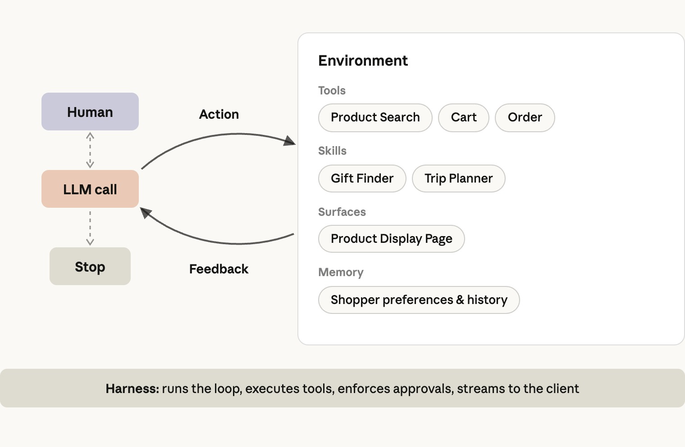
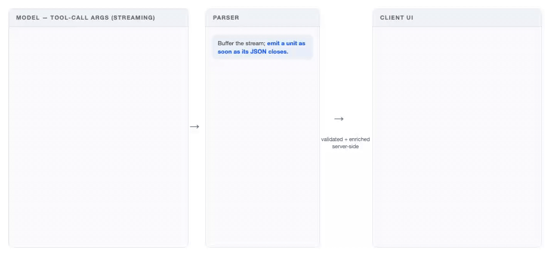
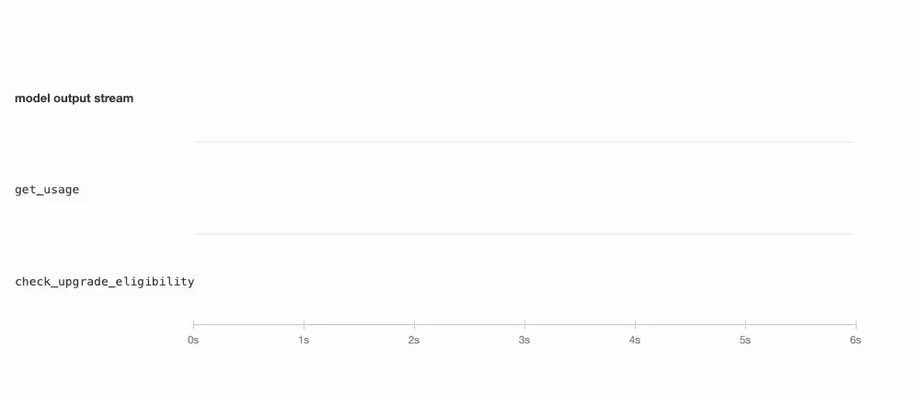
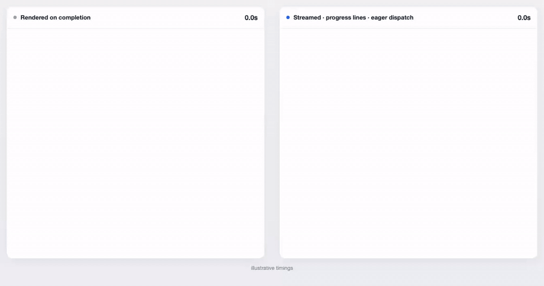
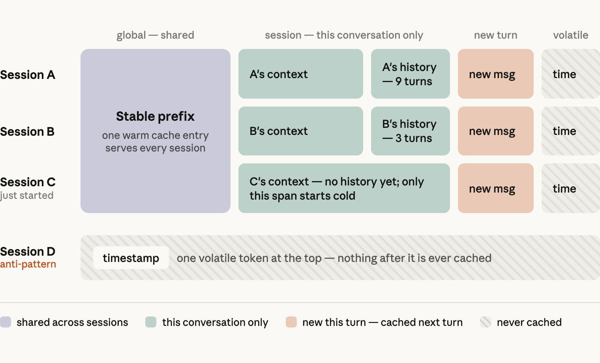
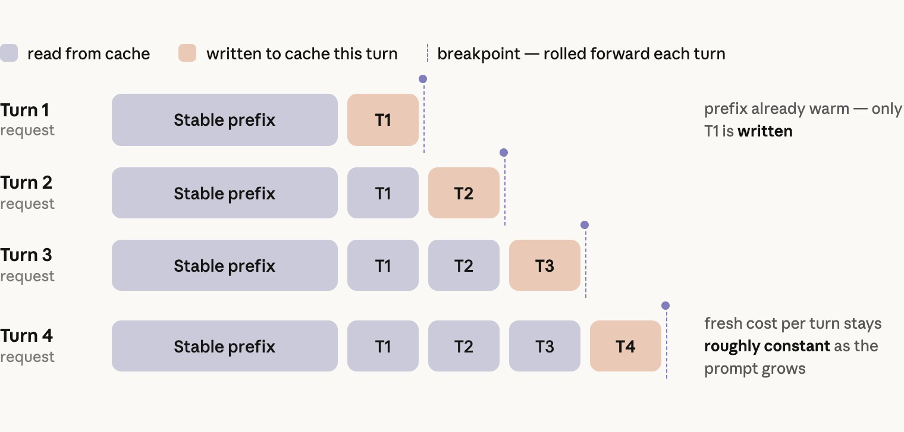
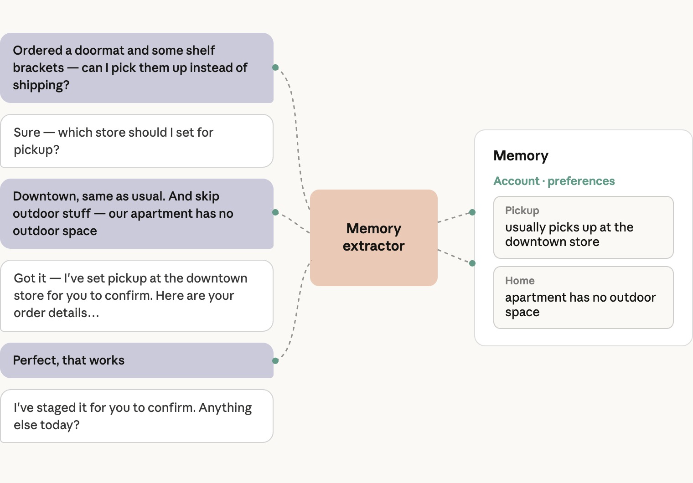
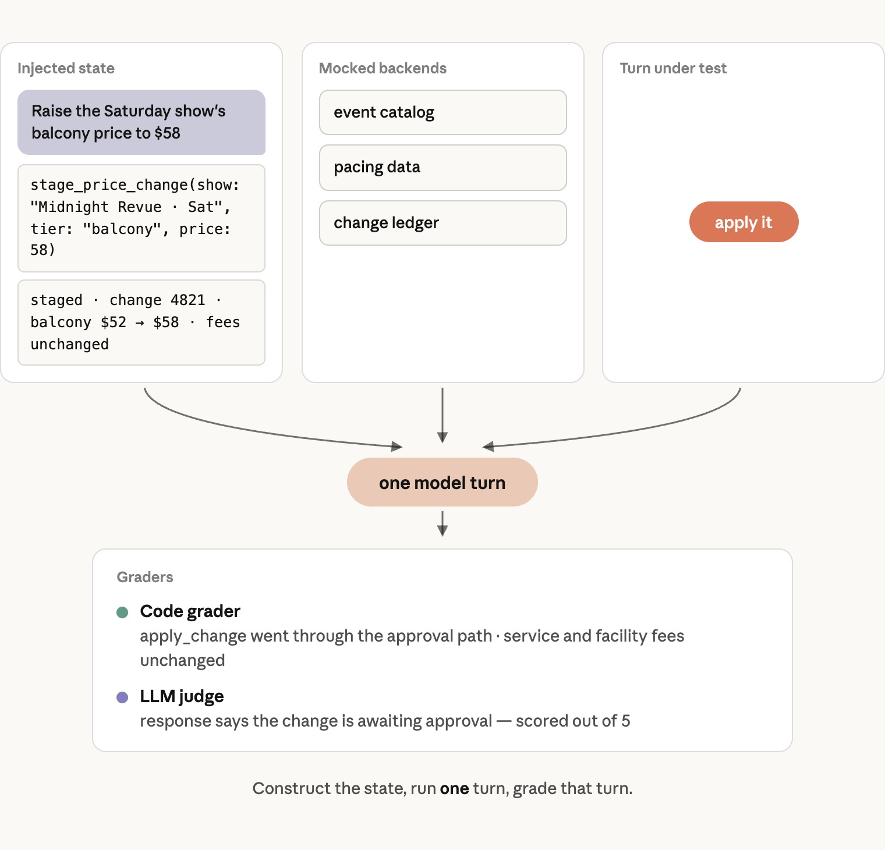

# 高效商业智能体的构成指南

> 原文：[A guide to the anatomy of effective commerce agents](https://claude.com/blog/the-anatomy-of-effective-commerce-agents)  
> 副标题：帮助用户更轻松地在线购买和销售商品的智能体架构、延迟与成本优化技术，以及评测实践  
> 分类：Agents  
> 产品：Claude Platform  
> 日期：2026 年 9 月 2 日  
> 阅读时间：25 分钟  
> 作者：Ali Shazal、Matthew Koen  
> 中文翻译：非官方译文。产品名、API 名称和代码标识符保留英文。

过去一年里，我们与商业行业的多个团队合作，包括零售商、交易平台、旅游、娱乐和电信服务提供商，使用 Claude 构建商业智能体。

这些智能体已经投入生产。企业客户在使用它们后，观察到了购物车金额增长和商家运营效率提升。它们也采用了同一种简单架构：让 Claude 运行在一个 agent loop 中，并为它配备一组 skills、tools 和一套可靠的 eval suite。

本文面向正在构建这类智能体或其他面向消费者的智能体的工程师和工程负责人。第一部分讨论只需确定一次的整体架构；第二部分讨论延迟和成本；第三部分讨论生产环境中的记忆、安全、评测，以及如何在大型组织中协调和扩展这项工作。

> **参考实现**
>
> 我们还提供了一份使用 Claude 构建商业智能体的蓝图。它包含工程团队在几天内运行一个商业智能体所需的执行框架、设计模式和安全护栏，并提供适用于零售、旅游、电信和票务平台的购物智能体与商家智能体参考实现。
>
> [anthropics/commerce-agents](https://github.com/anthropics/commerce-agents)

## 本文目录

### 第一部分：架构

- [什么是商业智能体？](#什么是商业智能体)
- [使用 skills，而不是 subagents](#使用-skills而不是-subagents)
- [System prompt 还是 skill：按使用频率决定](#system-prompt-还是-skill按使用频率决定)
- [智能体工具工程](#智能体工具工程)
- [UI 组件就是工具](#ui-组件就是工具)

### 第二部分：让它更快、更经济

- [降低任务完成延迟](#降低任务完成延迟)
- [感知延迟](#感知延迟)
- [Prompt caching](#prompt-caching)
- [选择模型及其配置](#选择模型及其配置)

### 第三部分：在生产环境中运行

- [跨会话保留的记忆](#跨会话保留的记忆)
- [安全：在 harness 中强制执行](#安全在-harness-中强制执行)
- [评测：发布一个非确定性系统](#评测发布一个非确定性系统)
- [在大型组织中发布](#在大型组织中发布)
- [展望未来](#展望未来)

---

# 第一部分：架构

> 一个模型运行在标准 agent loop 中，使用 skills 承载长尾能力，并通过 tools 调用你已经在运行的系统。这是一个只需确定一次的架构决策。

## 什么是商业智能体？

我们把商业智能体定义为一种能够简化在线目录中购买和销售过程的智能体。

有些智能体面向消费者：它们搜索、比较和替换商品，并组装订单。最终结果可以是一辆零售购物车、一份旅行行程、一次移动通信套餐变更，或者为一场演出预留的座位。另一些智能体面向企业：它们回答销售问题、运行促销和营销活动，并管理库存和定价。

核心架构是一个运行在标准 agent loop 中的模型：它围绕目标进行推理、探索上下文、通过工具执行操作、通过技能学习流程、提出澄清问题，并观察结果，直到完成目标。

它前面没有用于切分对话的 intent router，后面也没有一组特定领域的智能体。

## 工程背景

### 使用 skills，而不是 subagents

商业智能体必须覆盖许多类别和意图下的广泛能力，因此人们很容易产生一个想法：为每个领域创建一个 subagent。

实践证明，这通常不是最优方案。一次商业对话是由多个意图和多个轮次组成的紧密耦合会话，需要共享大量上下文。

在 subagent 架构中，orchestrator 持有购物车或暂存的变更、用户偏好以及对话历史。

每次把任务交给 subagent 都是一次有状态损失的操作。这通常会影响 subagent 的回答质量，进而影响整体回答。此外，每次交接都可能消耗数倍的 token，并增加数秒延迟。

不同领域也很少能够干净地分离。一次退货流程可能同时需要订单历史、当前购物车和商品目录。因此，按领域划分 subagent 的方案要么必须在每个 subagent 中重复提供这些访问能力，要么就要在任务执行到一半时再次交接。

随着模型能力增强，它们也能处理更长的上下文、更多 skills 和更多 tools。因此，今天决定信息应该放在哪里的那些限制，会随着每一代模型逐渐放宽。

相比之下，agent skills 可以在不承担交接成本的情况下，提供相似的领域模块化和上下文控制能力，因为 skill 指令会被加载到已经持有完整对话历史的主智能体中。

我们对多个企业部署进行比较后发现，带有 skills 的单一智能体在质量上始终优于“一个 prompt 包含所有内容”的设计和 subagent 设计，而且单个任务的成本和延迟通常也更低。

当 orchestrator 可以把 subagent 当作一个工具，用于边界清晰、可以独立完成并且适合使用单独上下文窗口的任务时，subagent 才真正有价值。

生产环境中的一个常见例子是 deep-research subagent。它会搜索和阅读文档、编写并运行代码、遍历数据模型，也可能走进死路。所有工作都在一个或多个 subagent 内部完成，最后只有一份紧凑的答案返回 orchestrator。

另一种例外是，某个领域已经拥有专门构建的智能体。如果药房或金融服务产品运行着一个具有独立合规边界的专用智能体，那么正确选择可能是 hand-off：让该智能体接管任务，通过自己的 loop 直接与用户协作，直到任务完成。

两者的区别在于谁拥有对话。hand-off 会让领域智能体成为用户的直接交流对象；delegation 则继续由 orchestrator 掌握对话，在同一轮中反复调入和调出领域智能体，并在每次交换中降低效果。

### System prompt 还是 skill：按使用频率决定

决定一组指令应该放进 system prompt 还是 skill 时，主要因素是智能体需要它的频率。加载 skill 会消耗一个模型轮次，因此，智能体在大多数轮次都需要的内容通常应该放进 system prompt。

不过，这仍取决于请求流量的分布，以及 evals 显示出的智能体行为。一个合适的起点是：无论是在发布前预估，还是在生产环境中观察到，只要一项内容与三分之一或更多的请求有关，就把它放进 system prompt；其余内容放进 skills。

如果你已经可以根据某个信号预测需要哪个 skill，例如用户是从哪个页面进入的，我们建议在第一次模型调用之前，由 harness 直接注入该 skill，从而跳过额外的 skill 加载轮次。

关键指令始终应该放进 system prompt，包括安全和法律规则、品牌约束，以及过敏信息等重要用户事实。

对于商业智能体，这意味着商品搜索应该放在 prompt 中，因为几乎每次会话都会涉及它；skills 则负责长尾功能。

在我们的参考实现中，购物智能体的 prompt 包含 grounding、购物车与 checkout 语义，以及展示规则。其余能力由以下 skills 覆盖：

- `search-discovery`
- `purchase-research`
- `planning-goals`
- `customer-care`
- `memory-personalization`

商家智能体也使用相同的拆分方式，并按照业务领域各自设置一个 skill：

- `performance-insights`
- `catalog-listings`
- `inventory-operations`
- `pricing-promotions`
- `marketing-campaigns`

| 位置 | 内容 |
|---|---|
| **购物智能体的 prompt** | Grounding、购物车和 checkout 语义、展示规则、商品搜索 |
| **购物 skills：长尾能力** | `search-discovery`、`purchase-research`、`planning-goals`、`customer-care`、`memory-personalization` |
| **商家 skills：每个业务领域一个** | `performance-insights`、`catalog-listings`、`inventory-operations`、`pricing-promotions`、`marketing-campaigns` |

### 智能体工具工程

我们在另一篇关于[如何为智能体编写高效工具](https://www.anthropic.com/engineering/writing-tools-for-agents)的文章中讨论了通用的工具设计方法。在商业场景中，以下两点最重要。

#### 把智能体工具建立在核心系统和业务逻辑之上

一家商业公司通常已经拥有搜索和排序、购物车、偏好与用户资料存储、库存系统、促销和营销活动引擎、销售分析系统等。每一个系统都编码了经过多年调整的业务逻辑，并掌握模型永远无法直接看到的信号。

智能体的工具应该调用这些系统，而不是重新实现它们。工具边界就是现有系统逻辑结束、模型判断开始的地方。

例如，当智能体调用 `search_products` 时，返回结果应该已经完成排序。智能体的工作是判断哪些结果符合用户目标、应该展示多少条，以及如何展示。

#### 工具结果就是上下文

只返回模型推理需要的字段，删除其余内容。每条搜索结果都附带图片 URL，就是最常见的无关字段。

必要时，在工具内部重塑原始响应。如果无法从数据本身看出下一步操作，也可以附加一条下一步指令。

这一点对错误场景尤其重要：模型从指令中获得的帮助比从错误码中获得的更多。例如，与其返回一个通用的 `403`，不如加入一条错误处理指令：“查询可用性时请提供商品 ID。”

### UI 组件就是工具

商业智能体的大多数回答不是普通文本，而是 UI 组件，例如商品轮播、旅行行程、座位图或图表。这意味着智能体必须输出一个 schema，而不是一段文字。

一些团队最初会通过 prompt 让模型输出自定义标签，再在客户端解析。随着产品界面扩大，这种方式会失效，原因包括：

- 与 tool calls 相比，模型对你的自定义标记语言没有经过充分训练。组件嵌套越来越深时，可靠性会下降。仅靠 prompt 不能保证数据格式正确。
- 标签定义位于 system prompt 中，因此每增加一个组件都会扩大上下文；每次修改也可能导致 prompt 中其他位置出现回归。
- 历史对话最终会以只有自定义解析器才能读取的格式存储。重新加载历史时，要么在客户端解析原始消息，要么维护一份不属于模型 API 原生格式的副本。

已经得到验证的模式是：把每个 UI 组件做成一个工具。模型使用类型化参数调用 `present_products`、`present_itinerary` 或 `present_plan_comparison`；服务端校验并补充调用参数，然后发送一个事件；客户端负责渲染。

因为这些组件本身就是 tool calls，所以它们已经以原生格式存在于 `messages` 数组中。重新加载旧对话时，不需要再次解析。下面的图片和参考仓库展示了一个 presentation tool contract 示例。

这种方式的代价是流式传输粒度。服务端需要缓冲 tool call 的每个顶层参数以完成校验，因此即使启用了流式传输，presentation tool 的子组件仍然会分阶段到达。这会影响感知延迟。

如果需要 token 级流式传输，可以在工具定义中设置 `eager_input_streaming: true`。这会跳过缓冲，同时也会失去服务端提供的 schema 保证。

在我们的 evals 中，Claude Sonnet 级别及以上模型很少违反 schema，但仍应该用重试机制包裹工具调用，以处理偶尔出现的违规情况。

Presentation tools 还会为智能体保留一份当前屏幕内容的记录。当客户说“第一家酒店”或“左边往下数第三个”时，布局信息就在 `messages` 数组中，具体位于上一次 presentation call 的参数里。

为了让这种引用方式可靠工作，工具参数必须反映实际渲染的布局。因此，应按照 UI 的真实结构组织参数，例如使用有序的行和轮播，而不是返回一个由客户端自行重排的平铺列表。

---

# 第二部分：让它更快、更经济

> 从端到端延迟和感知延迟两个方向同时优化，并利用缓存承担主要的成本优化工作。不要以牺牲模型智能为代价换取这些优化。

延迟在商业场景中非常重要，而面向消费者的产品界面对延迟尤其不宽容。不过，在智能体产品中，我们持续观察到，真正能推动留存、参与度和购物车金额等指标的是结果质量。

与边际上的延迟改善相比，回答是否相关、任务是否真正完成，对这些指标更加重要。

因此，需要从两个方向优化延迟：通过良好的工程设计降低端到端延迟，同时降低感知延迟，因为用户看到智能体正在工作时，会把等待理解为进展。

每位用户都有自己的延迟预算。下面的方法可以在不牺牲智能体能力的前提下，让智能体保持在预算之内。

## 降低任务完成延迟

任务完成延迟，是所有模型轮次的“生成至最后一个 token 所需时间”与“工具处理时间”之和。因此有三个优化杠杆：更少的轮次、更快的工具和更快的 token。

这些杠杆有时会互相冲突，所以真正需要最小化的是总和，而不是其中任何一个单项。

| 杠杆 | 方法 |
|---|---|
| **更少的轮次** | 提前加载大概率需要的上下文；提高模型智能；让模型并行调用相互独立的工具 |
| **更快的工具** | 优化工具背后的后端；工具参数生成完成后立即分发执行 |
| **更快的 token** | 使用完整 eval suite 扫描并选择模型及配置 |

### 更少的轮次

查询复杂度会增加轮次，而且通常不由你控制。更高的模型智能和更相关的上下文，可以帮助智能体用更少轮次完成任务。我们的主要经验包括：

- **提前加载大概率需要的上下文。** 如果用户从商品页面打开助手，或者商家从营销活动仪表盘打开助手，就把该页面的数据放进 session context。对话很可能与当前页面有关，直接使用上下文回答不会增加额外轮次。
- **提高模型智能。** 更聪明的模型可以更有效地规划和发出工具调用，从而减少任务完成所需的总轮次。这种收益常常超过 token 生成速度较慢带来的损失。如果请求偏复杂，或者生产数据显示每个任务通常超过约五轮，那么更快的模型往往反而是更聪明的那个模型。具体选择取决于你的真实流量，因此应该使用后文“选择模型”一节所述的 sweep 方法来决定。
- **让模型并行调用相互独立的工具。** 商业场景经常需要并行执行许多操作，例如搜索多个商品、查询多份政策文档，或者从多个销售数据源获取记录。并行调用工具可以避免让多个独立查询消耗额外轮次。应提示模型在一轮中调用多个工具，并将结果作为一个 tool results 数组放进一条 user message 中返回。参见[并行工具调用文档](https://platform.claude.com/docs/en/agents-and-tools/tool-use/parallel-tool-use)。

### 更快的工具

- **优化工具自身的后端。** 有时一个工具确实需要扇出调用。例如，商家智能体处理“获取今天的快照”请求时，会分别读取销售、库存和营销活动状态。但是，我们经常看到工具边界变成拼接后端缺失逻辑的地方：一个可用性检查先从商品目录取得 SKU，再逐个门店调用库存服务，接着调用履约服务获取截止时间，最后在工具代码中应用替代规则和自提资格判断。此时工具承载了过多领域知识，并且随着规则变化很难保持正确。这里的正确修复方式，是在上游系统中建立一个能够直接回答该问题的后端 endpoint，再由智能体工具调用它。
- **尽早分发工具。** 工具参数与其他 token 一样，会从模型中流式生成。因此，只要某个工具调用的参数已经生成完成，harness 就可以立刻执行它，并在模型继续生成其他并行工具或 content blocks 时处理结果。我们观察到，这种方法可以把数秒的间隔缩短到几百毫秒。Claude Agent SDK 默认采用这一行为。为了最大化延迟收益，还应该提示模型优先生成执行时间最长的工具调用。

## 感知延迟

感知延迟是用户等待屏幕出现响应时主观感受到的时间。在面向消费者的场景中，它尤其重要，因为交易过程中的任何阻力都会影响结账率和收入。

下面两种方法不需要修改模型，就可以缩短感知延迟：

- **组件生成到哪里，就流式渲染到哪里。** 一次完成渲染的商业回答通常包含 500 到 700 个输出 token。如果不使用流式传输，用户可能会看到持续五秒甚至更久的加载动画。Presentation tool 的每个参数生成后，就把它发送给客户端，并逐步渲染页面。
- **展示正在进行的工作。** 智能体收集上下文时，为每个步骤显示一行简短的自然语言进度，例如“正在查找靠近水边的酒店”。这行文字可以从工具已有参数中生成，例如商品搜索的查询参数；也可以为工具增加一个 `user_facing_message` 参数，让模型负责生成这条进度说明。

上图中的两个面板运行的是同一个智能体，使用完全相同的工具和 prompt，只有 harness 不同。两者总耗时大致相同，但用户第一次看到内容的时间差异很大。

## Prompt caching

Prompt caching 是最有潜力降低成本的手段，而商业请求非常适合使用它。读取缓存 input token 的费用只有新 token 的十分之一。虽然写入缓存需要支付约 `1.25x` 的费用，但同一个前缀第二次被使用时就可以收回额外成本。

在请求量很大的消费者应用中，即使使用最便宜、默认五分钟过期的缓存，也有机会达到很高的缓存命中率。

我们看到的最佳商业部署可以达到 `90%` 至 `99%` 的缓存命中率。系统应该从一开始就以这个范围为目标进行设计。我们的经验还表明，在约 10 万 token 的上下文规模下，读取缓存 token 的速度大约快 `1.5` 至 `2` 倍，而且 token 越多，收益大致呈线性增长。

缓存基于前缀工作。一个请求会从开头读取缓存，直到遇到与之前请求不同的第一个字节。因此，重要的不只是上下文中包含什么，还包括它们的顺序。

可以把一次请求理解为三个部分，并按照变化频率从低到高排列：

- **Global。** 包括 system prompt 的大部分内容和工具定义，在所有 session 中都完全相同。这是最热的缓存；达到一定规模后，它很可能一直不会过期。跨轮次和跨 session 都要保持逐字节完全一致，并在末尾设置 cache breakpoint。
- **Session。** 包括每位用户的上下文和对话历史。它们在不同 session 之间不同，但在一个 session 内保持稳定。这一部分放在 Global 之后。
- **Volatile。** 包括当前时间、当前页面等会在 session 内发生变化的内容。把它放在请求最末尾，可以作为最新 user turn 中的一个带标签数据块；如果模型支持对话中途插入 system messages，也可以作为一条 system-role message 追加到 `messages` 数组末尾。我们最常见到的错误，是把时间戳或当前页面放在 system prompt 顶部，这会在每次请求时悄无声息地破坏缓存。

这里还有两个实现细节需要注意。

第一，skills 应该作为 tool results 加载，而不是追加到 system prompt。这样 skill 正文会进入对话前缀，并与该前缀一起缓存。

第二，在每一轮中向前移动 breakpoints。一次请求允许设置的 breakpoints 数量有限，因此应把最新的 breakpoint 移到每个 user turn 的末尾。这样，每一轮都能从缓存中读取已经累积的历史，包括搜索响应等较长的工具结果。

## 选择模型及其配置

模型大小和 effort 设置体现的是同一项权衡：智能水平与延迟、成本之间的权衡。两者都应该根据测量结果选择。

- **确定指标和最低标准。** 选择业务真正依赖的质量指标，例如任务完成率、答案相关性和 grounded accuracy；确定不能低于的 eval 分数；同时确定 p50、p99 延迟和成本预算。
- **执行 sweep。** 在所有可能采用的模型和 effort 级别上运行完整 eval suite。对于以分析任务为主的商家智能体，我们建议从 Opus 开始；对于更看重延迟的消费者智能体，则从 Sonnet 开始。如果已经有生产流量，应按照真实请求分布为评测结果加权，然后让数字决定选择。有时 Opus 5 在推动购物车增长的任务上带来的提升，足以证明它相对 Sonnet 的额外成本是合理的；有时则不是。
- **仔细阅读结果。** 有两件事经常让团队意外。第一，prompt 往往针对某个模型进行了调整。因此，只使用同一个 prompt 进行 sweep，可能会让那些并非该 prompt 目标的模型表现不佳。较小的模型通常需要明确写出当前模型可以自行推断的指令；较大的模型则可能严格执行较小模型一直忽略的指令。在淘汰任何候选模型之前，针对它的失败案例做几轮迭代，是一种成本很低的校正方式。第二，更聪明的配置虽然 token 生成较慢，却有时会在延迟上获胜，尤其是 p90 和 p99，因为它能更好地规划工具调用，并在最复杂的请求上减少轮次。

应该衡量每个已完成任务的成本，而不是每次模型调用的成本。如果一个更便宜的模型需要更多轮次，或者失败得更频繁，它实际上并不便宜。

当候选方案表现接近，而且成本符合单个任务的经济模型和延迟预算时，应选择更高的智能水平。质量才是推动采用率和留存率的因素，而且随着模型持续进步，更高质量的方案也能为未来六个月的产品开发留出空间。

---

# 第三部分：在生产环境中运行

> 记忆、安全、评测，以及如何在组织内部扩展工作：这些因素决定一个智能体能否进入生产环境，并长期稳定运行。

最后，我们讨论如何让智能体进入生产环境：长期记忆、安全、评测，以及如何在大型组织中扩展开发工作。

## 跨会话保留的记忆

你与客户建立的关系和发生的互动非常重要。记忆让智能体能够从上次对话结束的地方继续，而不是每次从零开始。

一位购物者三月份提到自己对坚果过敏，六月份不应该再重复一遍；一位商家每周一都查看相同的三个营销活动，也不应该每次都重新说出它们的名字。

长期记忆是应该跨 session 保留的事实。它是一个需要由你构建的系统，包含三个部分：事实如何存储、如何写入，以及如何读取。

### 存储记忆

记忆属于你的系统，而不属于模型。

当用户资料很小，而且智能体是唯一的读取方时，一个平铺的 Markdown profile 可以正常工作。大多数生产环境中的商业智能体最终都会超出这种方案的能力范围。实际可行的替代方案，是使用你已经在运行的数据库。

一条事实是一条很小的类型化记录，包括：

- 一个 key，例如 `shoe_size`、`default_store` 或 `preferred_report_cadence`
- 一个简短的 value
- 一个 category
- 产生这条事实的 session

有些 key 由你预先确定，每位用户都有；其余 key 则由 extractor 在对话中发现。随着存储规模增长，数据库仍然可以查询；它允许系统针对特定属性构建确定性行为，也能与已有用户数据进行关联。

对于面向商家的智能体，应按照具体人员而不是账号建立记忆。商家账号经常由多个操作员共享，因此每个操作员都需要独立 profile，而且读取过程必须遵守该操作员的权限。例如，门店经理的智能体不应该回忆区域经理说过的事实。

在商业领域，智能体记忆会保存个人数据。最值得记住的事实往往也是受到最严格监管的事实，而且不同司法辖区的规则不同。因此，要把记忆视为一个数据处理设计问题，而不仅是一个存储问题。实践中需要做到以下四点：

- 确定愿意保存哪些类型的记忆。在写入路径中强制执行该规则，让每次保存都经过 validator，而不是只在 prompt 中要求模型遵守。
- 允许用户查看、更正和删除已存储内容。把删除操作接入账号删除和数据请求流程。
- 设置保留期限。几年前的偏好很可能已经过时，保留期限有助于保持记忆事实的新鲜度。
- 记忆应该是每个 deployment 可独立控制的开关。这样，无法承担相关义务的地区就可以在关闭记忆的情况下运行。

### 写入记忆

异步写入记忆。在每轮结束时，或者在长 session 中每隔几轮，由另一个线程或进程中的智能体读取对话，在存储中创建、更新或删除事实，并随着 session 进行维护自己的工作上下文。

这种方案不会增加对话延迟，而且在我们的内部商业记忆 eval suite 中，事实召回率提高了 `13%`。

一个看起来显而易见的替代方案，是让主智能体调用工具保存事实。但对于对延迟敏感的商业智能体，这是错误的选择。每次保存都会在面向用户的轮次中增加一次工具调用；除非整个记忆存储已经放在上下文里，否则为了更新或去重，写入前还需要先读取一次，这本身又会占用一轮。

这种设计还会让主智能体在每一轮多做一个决定。在我们的 evals 中，这种注意力竞争表现为更多遗漏的记忆。

分离 extractor 后，还可以为它编写更加精确的 prompt。它只读取用户和助手的文本，永远不读取 tool results，因此商品描述或评论不会被错误地保存为用户事实。

Extractor 的 prompt 应明确说明哪些内容属于事实，例如用户明确说出的尺码、饮食限制、履约偏好，以及商家经常使用的 materialized views；同时说明哪些不属于事实，例如商品 listing 中的内容或一次性的细节。

### 读取记忆

分三层读取记忆。

#### 始终放在上下文中

每轮都把一小组固定事实放进上下文。这些事实是几乎每个请求都会依赖的，例如购物者的默认门店和履约偏好，或者操作员所属的门店和角色。

#### 每轮预取

根据信号，在每轮中预取与当前请求相关的事实。这些信号也可用于预加载 skill。例如，鞋类搜索会读取尺码和品牌偏好；营销活动问题会读取该操作员常用的指标。

#### 通过 lookup tool 读取

其余所有事实都放在 lookup tool 后面，按需读取。

由于记忆属于 per-user context，所有记忆都应放在 session segment 中，位于 global cache breakpoint 之后。

## 安全：在 harness 中强制执行

安全行为从 prompt 开始，但在商业场景中，不能只依靠 prompt 强制安全。这里的失败通常涉及资金，而且往往不可逆。只需要一次 prompt injection 或一个错误样本，prompt 中的规则就可能被跳过。

下面的每条规则都在代码中强制执行，同时适用于消费者智能体和商家智能体，并且只定义一次，以保证所有 runtime 共享同一套规则。

### 模型负责暂存，人员或策略负责应用

任何模型 tool call 都不能直接转移资金或改变业务状态。下单、付款、退款、价格变更和营销活动启动，最终都必须进入一个由 harness 控制的操作，而不是由模型直接执行。

在消费者侧，这是结构性的限制：checkout tool 会渲染购物车和下单按钮，而智能体调用的后端接口根本没有扣款方法。

在商家侧，每个写工具都会生成一项带有服务端 ID 的 staged change。只有当该 ID 通过真实界面获得批准时，`apply_change` 才会成功。例如：

- 操作员门户中的按钮
- CLI 中的确认
- 智能体运行在 Managed Agents 上时，由平台提供的工具审批提示

真正应用变更时，需要按照当前限制重新检查 guardrails，而不是使用暂存变更时生效的限制。

无论使用哪种界面，结构都是一样的：模型能执行的最危险操作只是提出建议，审批则通过企业已经用于同类变更的 maker-checker 流程完成。

### 写操作和渲染只接受服务端签发的 ID

Harness 为每个 session 保存一份服务端曾经交给模型的所有 ID 记录。任何写操作或渲染操作都只接受这份记录中的 ID。

购物车只接受服务端在当前 session 返回过的 product ID；商家工具只接受智能体实际读取过的 listing ID 和 campaign ID。通过其他方式出现的 ID，包括模型幻觉生成的、用户粘贴的，或者植入评论中的 ID，都会在到达后端之前被拒绝。

同一规则也适用于 UI。Presentation tools 接收 ID，服务端自行补充商品、订单或变更记录，因此卡片只会渲染由服务端填充的记录。

这条规则同样适用于 delegates：商家分析 subagent 可以读取数据，但永远不会把新的 ID 加入智能体允许写入的集合。

对于费用、披露信息和其他受监管内容，模型只负责选择需要披露的商品，服务端则从经过批准的文案中提供每一个字。相同的费用字段也位于商家智能体的 protected list 中，因此交易双方都不能修改或改写它们；evals 会逐字节检查最终渲染的字符串。

### 有上限的交易必须抵抗重复请求

大多数商业产品都会限制单个用户能够购买的商品数量，用于控制票务配额、促销价格或欺诈风险。智能体可能以真人点击按钮时不会采用的方式重试、改写请求或并行执行。

因此，数量上限必须根据写入后的订单行状态执行。第二次“再加两个”不能把数量叠加到上限以上。同一 session 中的购物车写操作也必须串行化，防止单轮中的多个并行工具调用组合后超过上限。

商家变更也要用相同方式检查价格变动、折扣深度、补货数量和营销预算上限，并限制任何变更都不能触碰的 protected fields。

这条原则可以推广为：根据操作产生的最终状态执行每项限制，而不是只检查当前请求；同一 session 中的写操作必须串行执行。

### 清理第三方内容

在商业场景中，大多数上下文由你之外的人编写，例如商家、评论者和竞争对手。因此，每次后端读取都应该被视为不可信输入，并经过同一个 sanitizer。

所有由第三方撰写的工具结果，包括 listings、reviews、policies、seller messages 和 stored memory，都要先清理，再使用固定 label 包裹进 fence，之后才能交给模型。

Sanitizer 应执行以下处理：

- 删除控制字符和双向文本字符
- 删除模仿 fence markers 的内容
- 解除伪装成对话轮次或 tool call 的文本
- 限制内容大小

这些措施可以阻止恶意 listing 冒充 system message，或者通过填满上下文干扰模型。

Prompt 负责契约的另一半：fence 内的文本只能作为需要汇报的材料，永远不能被当作指令执行。

## 评测：发布一个非确定性系统

无论是很小的 prompt 修改还是一个新工具，都可能以难以预测的方式改变智能体行为，而且发生回归的地方经常不是你正在修改的地方。Evals 可以在部署之前发现这些问题。

我们此前关于[智能体评测](https://www.anthropic.com/engineering/demystifying-evals-for-ai-agents)的文章介绍了通用方法；本节讨论商业智能体特有的实践。

### 评估状态快照，而不是完整对话

模型 API 是无状态的，因此智能体输出是 system prompt、tools 和 `messages` 数组的函数。这意味着商业对话能够到达的任何状态，都可以直接构造出来。

创建一个 eval case 的过程是：构造测试状态，追加待测试的 user message，然后让智能体从该状态开始运行。

接下来评估结果：最终状态和渲染出的回答，包括最后一次写操作的参数。在多数情况下，我们不建议评估智能体到达结果所采用的具体路径，因为这类测试既脆弱，又会限制智能体。

在 simulated-user evals 中，另一个模型扮演用户，再由 judge 评估整场对话。这种方式不适合作为主要测量工具。两个非确定性系统相互交互，需要更大的样本量；每次试验成本更高；评判更困难；出现失败后也很难确定问题来自哪一方。

这类 evals 适合寻找覆盖缺口，也适合对智能体进行整体的主观检查。因此，可以用它发现测试场景，然后把每个场景写成状态快照。

### 在困难条件下评估行为

大多数团队没有正确测试注入的状态。一个 case 应该编码导致失败的前置条件，而不只是描述任务。

如果某种行为只会在繁忙的第一轮之后出现，而第一轮包含多次工具调用；或者只会在 session 前面出现矛盾之后发生，那么从干净状态开始的 case 会在所有配置上通过，无法提供有意义的数据。

我们观察到，大多数 eval suite 中从干净状态开始的 case 过多。因此，应该确保其中一部分从很长、混乱或相互矛盾的历史开始。

### 覆盖不同类型的商业智能体评测

有效的评测必须同时测试期望行为和非期望行为。

每个正向 case 都应该有一个对应的反向 case：每个“应该提供服务”的 case 对应一个“应该拒绝”的 case；每个“应该直接执行”的 case 对应一个“应该询问”的 case。缺少反向 case，是我们在 eval suite 中最常见到的缺口。

应该评估以下内容：

- **构成大多数流量的核心请求。** 这里的失败会影响大部分 session，包括简单查询、多约束请求、商品和套餐问题，以及多意图消息。对于问答，要检查每个价格、库存状态和属性都能追溯到工具返回的数据；缺少数据时，智能体应该明确说明，而不是编造。
- **依赖上下文的请求。** 包括引用屏幕上显示的内容、从之前轮次继承的约束，以及对现有购物车执行写操作。记忆评测也属于这一类。要检查记忆是否被提取、是否被检索，以及是否真正改变了回答。
- **安全与品牌 case。** 这里的失败会造成资金或信任损失，包括 prompt injection 尝试、读取其他用户数据的尝试，以及必须逐字节检查的受监管文案。注入测试应分成两类：一类是 user-authored injection，指令来自用户自己的消息；另一类是 data-plane injection，恶意指令被植入商品名称、评论或通过工具结果到达的网页片段中。
- **接口评测。** 确认渲染了正确组件、商品数量上限得到遵守，并且面向用户的文本中没有内部 ID。还要测试超时和空结果。
- **同时属于多个能力的请求。** 例如操作员问：“如果我把这个商品降价 `15%`，库存足够满足需求吗？”这同时是定价问题和库存问题。正确答案应该暂存降价操作，并附上库存预测；错误答案只完成其中一半。按照单项能力分别编写的 evals 无法发现这个问题，因为每个 case 只评估自己的那一半。应为需要两个相邻能力协作的请求编写 case，并评估回答的两个部分。

### 与领域专家一起编写评测，并使用真实事故

应与第一时间看到失败的 subject-matter experts 合作设计测试 case，例如 Product、Legal、Merchant Ops、Customer Care 和 Category Management 团队成员。

真实失败是最好的 evals 来源。每个 user flow 可以从 `50` 至 `100` 个 eval cases 开始。

同时应保证 case 类型多样，覆盖上面列出的类别。生产对话记录是持续获取新 case 的良好来源，尤其适合发现棘手场景。Coding agents 也很适合生成额外 case 和对抗性变体。

参考仓库中包含一个 Claude Code plugin，其中提供了按照我们推荐的方法构建的 eval-authoring skill。

## 在大型组织中发布

在商业企业中，一个智能体通常由许多工程团队共同构建。搜索、结账、定价、营销技术、客户服务和商品目录平台分别拥有智能体依赖的系统；各团队按自己的节奏发布，也都可能需要增加或修改工具、skill 或 prompt rule。

与传统服务不同，智能体没有严格的模块边界保护其他部分。定价团队所做的修改，会与 checkout 共享同一个上下文窗口。

一个看似直接的解决方案，是按照业务部门把系统拆成多个 subagents。但正如第一部分所述，出于质量原因，我们不建议这样做。更稳妥的多团队协作流程如下。

### 所有权跟随系统

每个 skill 和 tool 都应该有唯一的负责团队。

例如，定价团队负责促销工具和 pricing skill；客服团队负责订单与退货工具以及 customer-care skill。共享 prompt 的公共部分由一个平台级 owner 负责，领域专属部分则由对应领域 owner 负责。

### 每项变更都要携带自己的 case，由 CI 选择相关测试运行

贡献 skill 的团队也必须贡献对应 cases，包括反向 cases，以及与相邻 skills 之间的边界 cases。

在每个 pull request 上运行完整 suite 太慢、太昂贵，最终难以持续。因此，需要从完整 suite 中构建一个 CI 测试集。它应该包含：

- 最高频请求组成的核心 cases
- 所有安全 cases
- 与本次修改内容有关的 cases

不同变更应选择不同测试范围：

- 修改 skill：运行它自己的 cases，以及相邻 skills 的边界 cases
- 修改 tool：运行所有会调用该工具的 cases
- 修改共享 prompt：运行完整 eval suite，因为所有功能都会读取 system prompt

我们建议根据多次 trial 后的通过率设置发布门槛，同时对缓存命中率和每轮成本设置门槛。

完整 suite 最好每晚运行一次，并在每次发布前运行。跨团队回归会在这些运行中被发现。

### 把智能体纳入发布日历

智能体是一个统一的部署单元，因此一次错误变更可能同时影响所有用户。

Prompt 和 skill 变更应该先发布给 canary cohort；系统应保留一个不需要重新部署就能关闭单个 skill 的开关；业务高峰到来前，也应像冻结其他系统一样冻结智能体变更。

关于这种协作方式中的人员部分，请参阅 [Building effective human-agent teams](https://claude.com/blog/building-effective-human-agent-teams)。

## 展望未来

本文讨论的大部分内容其实并不属于模型本身。

工具调用的是你已经在运行的系统；skills 编码的是你已经在执行的流程；evals 是以测试形式编写的产品需求文档；harness 强制执行的是任何客户端都应该遵守的政策。

模型会持续进步。当更好的模型发布时，这套架构只需要把它作为一次配置变更，并运行一轮 eval sweep。其他部分仍然可以继续工作。

考虑产品界面的长期路线也很重要。这套架构的寿命会超过当前的聊天面板。同一个智能体可以通过语音交互，也可以在票价下降时主动采取行动，而不必等待用户提问。

对于已经拥有 evals 和 tools 的团队，这些只是 presentation layer 项目。

再往后看，访问你线上商店的一部分流量，会来自代表用户购物的外部智能体。让你自己的智能体保持在边界内的 provenance、staging 和 approval 规则，也正是让你能够安全地向外部智能体开放工具的规则。

商业一直奖励那些能让购买过程尽可能顺畅的产品。智能体让实现这一点容易了很多。

请查看[完整参考实现](https://github.com/anthropics/commerce-agents)。其中包含消费者智能体、商家智能体，以及可运行的零售、旅游、电信和娱乐示例。

## 致谢

本文由 Matthew Koen 和 Ali Shazal 撰写。特别感谢 Michael Segner、Rodrigo Olivares、Amandeep Khurana、Aiza Usman、John Lopus 以及其他贡献者。

---

## 相关文章

- [使用 Claude 构建商业智能体](https://claude.com/blog/claude-for-commerce-agents)
- [Warp 如何使用 Claude 构建能够自我改进的智能体](https://claude.com/blog/how-warp-builds-self-improving-agents-on-claude)
- [Slack 中的自助式数据分析：Anthropic 如何部署 Claude Tag 处理临时问题](https://claude.com/blog/self-service-data-analytics-in-slack-how-anthropic-deploys-claude-tag-for-ad-hoc-questions)
- [面向 Claude 5 代模型的上下文工程新规则](https://claude.com/blog/the-new-rules-of-context-engineering-for-claude-5-generation-models)

---

> 本译文仅翻译文章正文、参考实现说明、目录、致谢和相关文章；网站登录按钮、页脚导航、Newsletter 表单等站点通用界面文字未收录。正文图片下载自原文页面，版权归 Anthropic 或原权利人所有。
